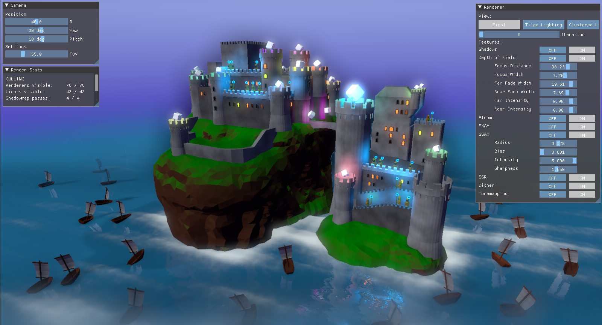

# DirectX 11 Renderer

This is a tiled and clustered renderer loosely inspired by a frame analysis of "Rise of the Tomb Raider", shown here: https://www.elopezr.com/the-rendering-of-rise-of-the-tomb-raider/

Here are the results so far:

## Features:
* Core
    *	Tiled deferred lighting
    *	Clustered forward lighting
    *	Dynamic shadow atlas
        *	Supports any number of point and spot light shadows
        *	Supports 1 cascaded directional shadow
    *	PCF shadow filtering
    * Dynamic water using gerstner waves
    * Distance-based tessellation
    * Stencil masking
* Post effects
    *	Depth of field w/ separable disk filter
    *	SSR methods:
        * 3D raymarch (for testing)
        * Nonconservative DDA
        * Binary search
    *	Bloom w/ separable gaussian filter
    *	HDR + tonemapping
    *	Dither
*	Optimizations
    * Instancing
    * Draw call sorting to minimize state changes
    * Depth prepass
    * Hi-Z buffer
    *	Frustum culling via AABB scene graph

## Depth of Field

Depth of Field is an effect that approximates a "circle of confusion" (CoC) for pixels based on how far they are from a focal point. Cameras usually have a CoC that looks like a disk or hexagon-shaped bokeh.

Disk filters normally require 2D filters, which are very slow. However, I found some articles describing a disk approximation which used separable 1D filters and complex numbers. (Implementation in Frostbite: https://dl.acm.org/doi/10.1145/3084363.3085022, lots of math: http://yehar.com/blog/?p=1495, and more examples: https://bartwronski.com/2017/08/06/separable-bokeh/).

I used these passes:
1. Prefilter - calculates near and far CoC and pre-multiplies RGB by the CoC
2. Far blur pass - executes 2 components in 4 dispatches
3. Near blur pass - executes 1 component in 2 dispatches
4. Composite - combines camera color with near and far bokehs

### Step 1: DoF prefilter:

This step calculates near and far CoC, and creates temporary rendertextures with the source image multiplied by the CoC.

### Step 2: Near DoF:

Note that the last step includes both a vertical pass, and combining the real and imaginary values to a single RGB value. Doing these at once saves a compute dispatch.

### Step 3: Far DoF:

Using 2 components for far blur increases the quality. This helps, as far blur will often be more noticeable than near blur.

### Step 4: Final composite:

The result is wide, circular blur at a reasonable cost!

## Distance-Based Tessellation

Since the water animation is based on math (gerstner waves), it fit tessellation well. I used quad patches, and setup the hull shader so that neighboring patch edges always had the same tessellation factor. To do this, I averaged the two control points for each edge, and measured their distance from the camera.

Then I further reduced the tessellation factor for distant patches when viewed at an angle.

## Tiled Deferred Lighting

The idea behind tiled lighting is to only calculate lights (and shadows!) for opaque geometry only where pixels are in the light range. It divides the screen into tiles and uses the depth buffer to get min and max depth for each tile.

Here's a debug view showing light counts per tile:

Normally, this is done in 1 compute shader with 3 stages.

1. Find depth range of tile
2. Find indices of lights within tile
3. Calculate per-pixel lighting

In my implementation, I skipped the first stage and instead obtained the min/max depth range from a Hi-Z buffer computed beforehand.

When calculating light intersections, I used both Frustum-Sphere and AABB-Sphere tests. By themselves, each method create false positives, which the other method accounts for.

For the per-pixel lighting, I wrote to diffuse and specular light textures. This gave materials more freedom to use simple or complex lighting models.

## Clustered Forward Lighting

Clustered lighting is great for transparent objects, as it has minimal reliance on the z-buffer. It uses a 3D buffer of mini-frustums that encapsulate the full camera frustum. This buffer stores indices of intersected lights, which shaders can read from to know what lights they should calculate.

This debug view shows a histogram of light counts per mini-frustum:

The z-bounds of each 3D cluster should be divided in a way that makes far clusters take about as much screen space as near clusters. It should also use a function that has an easily calculated inverse. I used the function described here: http://www.aortiz.me/2018/12/21/CG.html#part-2

As an optimization, I checked the Hi-Z buffer for each cluster. If the maximum depth was closer than the far Z of the cluster, that meant the cluster was entirely occluded by opaque geometry. In this case, there was no need to calculate light intersections.

## Dynamic Shadow Atlas

Each frame, lights are culled against the camera frustum. Shadowed lights in view are then assigned a section of the shadow atlas to render to.

## Instancing

Instancing was hugely beneficial for reducing the number of draw calls and GPU commands. The instancing system I added allows for updating transforms, so it can be used for things like boats that move with water waves.

## Material sorting

Another helpful optimization was applying GPU bindings only when needed, and sorting draw calls to minimize changes to those bindings. I used an unsigned 64-bit int to store a "code" for each material, and then sorted by that code. Shader program changes are especially slow, so I had the sort prioritize those. The result is that draw calls with the same shaders are drawn together.

## Bloom

For the blur, instead of multiple up and down-sampling passes, I used a compute shader and calculated a separable gaussian blur in 2 passes (horizontal and vertical). Each pass caches texture samples in groupshared memory to reduce the cost of texture accesses.

## References:
1. _"The Rendering of Rise of the Tomb Raider"_. (2018). https://www.elopezr.com/the-rendering-of-rise-of-the-tomb-raider/
2. Kleber Garcia. 2017. _"Circular separable convolution depth of field"_. (2017). https://dl.acm.org/doi/10.1145/3084363.3085022
3. Ollie Niemitalo. 2010. _"Circularly symmetric convolution and lens blur"_. (2010). http://yehar.com/blog/?p=1495
4. Bart Wronski. 2017. _"Separable disk-like depth of field"_. (2017). https://bartwronski.com/2017/08/06/separable-bokeh/
5. Ángel Ortiz. 2018. _"How to Implement Clustered Shading"_. (2018). http://www.aortiz.me/2018/12/21/CG.html#part-2
